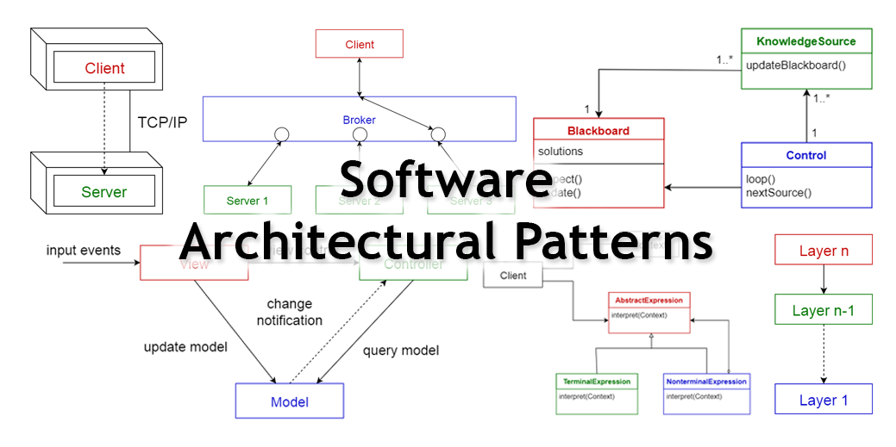

## Meeting the Same Problems

We are often solving the same problems that come up again and again. It only makes sense to come up with "blueprints" or a general solution to solve some of these common problems. Design patterns are essentially blueprints that have an end goal and some of the steps to reach that goal, but they can be bent to suit our application. I have to admit that I am not too familiar with many specific design patterns, but in my research about them, I've learned that there have been a few that I've already used in the past.  

## Coding By Parts

The first design practice I can think of is called the module pattern. This is essentially treating each file as its own module, keeping particular parts of code independent of the rest of the application. In my final "Brainbows" project, we have multiple files used for different components such as files for students, study sessions and the navbar

## More Coding By Parts

Another pattern used in our "Brainbows" project is the container component pattern. In React, this is where a component or container is responsible for the actual functionality of the application, and another container is responsible purely for the design of the application. We have an entire directory called "pages," which sole responsibility is to render the components in a way that is visually appealing to the user.

## I Still Have Much to Learn
While I'm not too familiar with too many design patterns, I'm inevitably going to use them in my projects. It would obviously save so much time as these are solutions to problems that have already been solved.

Note: Github Copilot was used to help identify design patterns in my project.
