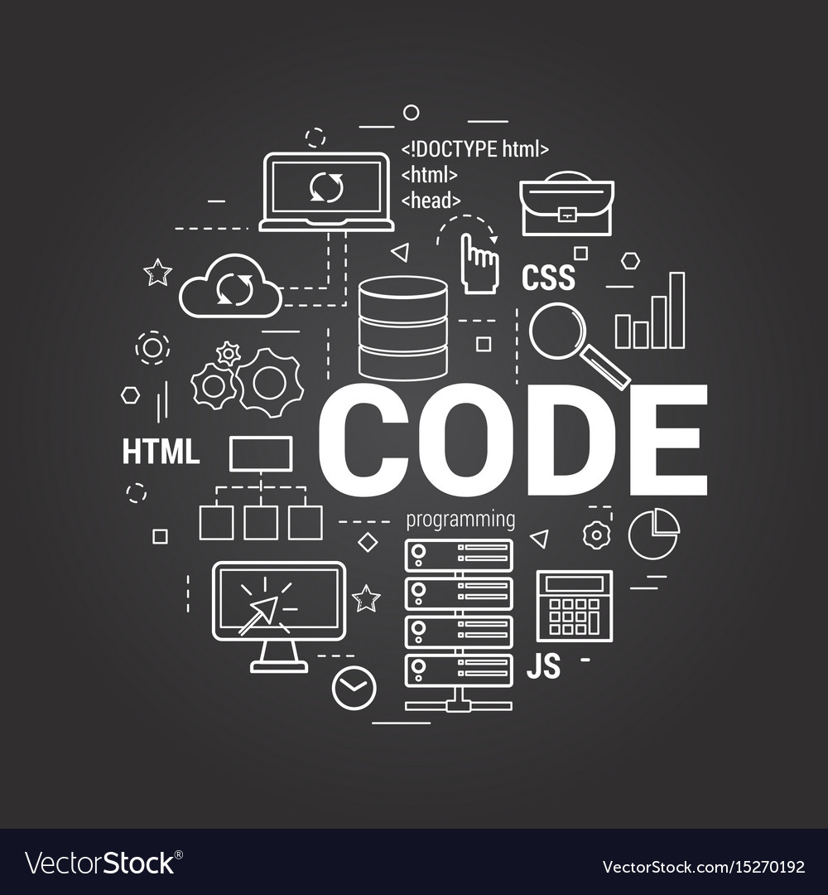

## Why Have Coding Standards?

Following any sort of standard might seem annoying at first, but they're standards for a reason. Right off the top of my head, having standards in software engineering greatly improves code readability. Another reason why we have standards is for maintainability reasons. It is much easier to debug or improve old code if there is a uniform way of coding.

## Coding Standards Automated

Luckily for us, we live in the age of convenience, which means we have built-in tools to help us adhere to these coding standards. ESLint is one such example that I have a little experience in. The developers of ESLint describe their program as "a static code analysis tool for identifying problematic patterns found in JavaScript code." ESLint warns you about a wide range of problems, from unused functions to an inconsistent number of spaces used.

## We NEED Coding Standards

At a glance, it basically looks like your older brother backseating the way you code, and it can definitely feel like that sometimes. However, he is doing it because he cares about the future software engineers who are inevitably going to have to maintain your code. What may be readable to one engineer may seem like complete gibberish to another engineer.

Note: ChatGPT was used to fix any spelling/grammatical errors.