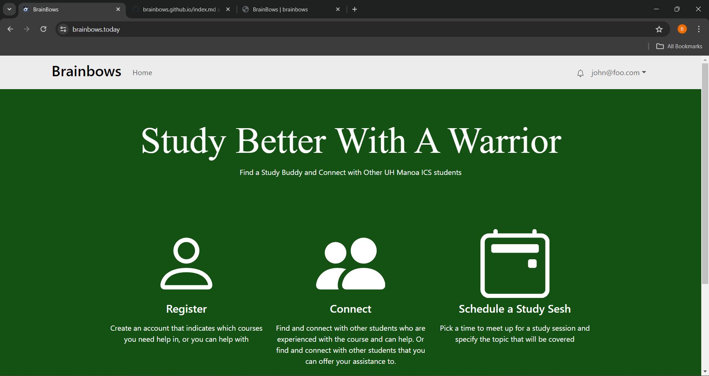
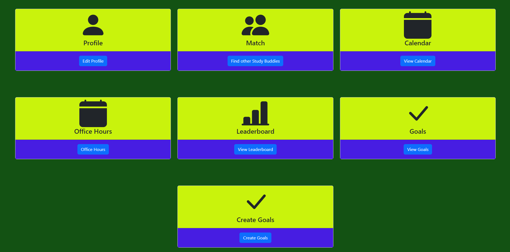
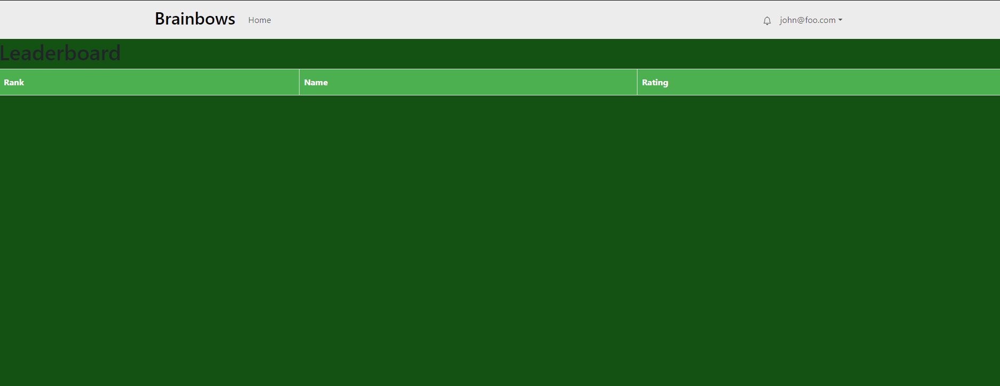
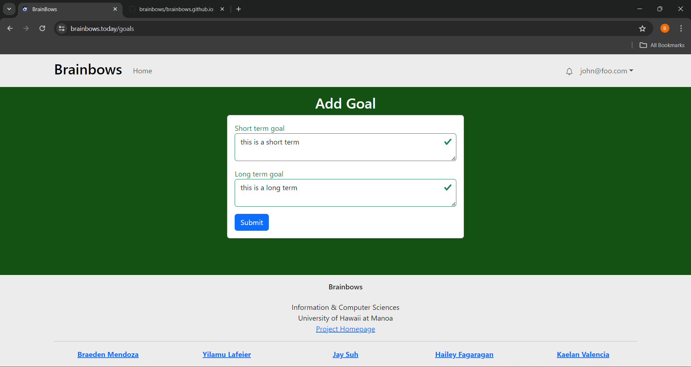

This is an application that allows users to connect with other users and set up a study session. Users create a profile and pick if they're a "sensei" or a "grasshopper" in a particular subject. They can then match with other senseis and grasshoppers in a chatroom after scheduling a time for their study sesh on the calendar. Users can also view the office hours of various other professors and TAs, if they wish to have a second opinion or more help. Users can rate their senseis and they are ranked based on their performance. It is only for ICS students and professors in its current state.

I worked on the user home page, the leaderboard page, and the goals page. The user home page consists of cards with buttons explaining the pages that the buttons are linked to. The leaderboard page ranks senseis based on performance in descending order. The goals page allows users to keep track of any particular short term and long term goals they wish to achieve. I needed some help with the view goals page and leaderboard page due to extenuating circumstances, and luckily my teammates were there to help me out.

My main takeaways from this project were effective team communication, implementing collections via Meteor, using React components to display my webpages, and using Bootstrap to style my pages.

Here is a link to the project page:
<a href="https://github.com/brainbows/brainbows-source-real">Brainbows source code</a>

Here is a link to the repository:
<a href="https://brainbows.github.io">Brainbows Project Home Page</a>
